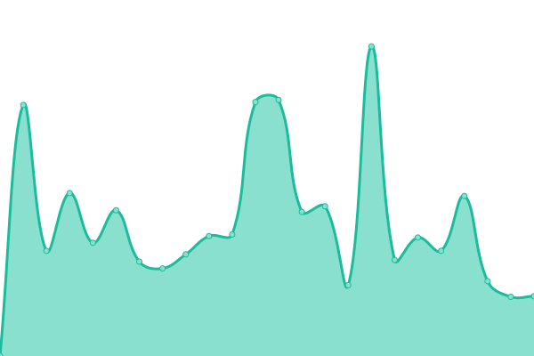
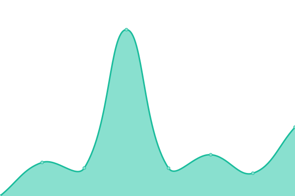

# [📈 Live Status](https://Rayuela90.github.io/upptime-sacvefor): <!--live status--> **🟩 All systems operational**

This repository contains the open-source uptime monitor and status page for [Rayuela90](https://Rayuela90.github.io/upptime-sacvefor), powered by [Upptime](https://github.com/upptime/upptime).

With [Upptime](https://upptime.js.org), you can get your own unlimited and free uptime monitor and status page, powered entirely by a GitHub repository. We use [Issues](https://github.com/Rayuela90/upptime-sacvefor/issues) as incident reports, [Actions](https://github.com/Rayuela90/upptime-sacvefor/actions) as uptime monitors, and [Pages](https://Rayuela90.github.io/upptime-sacvefor) for the status page.

<!--start: status pages-->
<!-- This summary is generated by Upptime (https://github.com/upptime/upptime) -->
<!-- Do not edit this manually, your changes will be overwritten -->
<!-- prettier-ignore -->
| URL | Status | History | Response Time | Uptime |
| --- | ------ | ------- | ------------- | ------ |
|  TRAZ Frontend | 🟩 Up | [traz-frontend.yml](https://github.com/Rayuela90/upptime-sacvefor/commits/HEAD/history/traz-frontend.yml) | 

 1180ms
     
 | 

<a href="https://Rayuela90.github.io/upptime-sacvefor/history/traz-frontend">100.00%</a>
    

|  TRAZ Backend | 🟩 Up | [traz-backend.yml](https://github.com/Rayuela90/upptime-sacvefor/commits/HEAD/history/traz-backend.yml) | 

 1010ms
     
 | 

<a href="https://Rayuela90.github.io/upptime-sacvefor/history/traz-backend">100.00%</a>
    

|  CGL Misiones | 🟩 Up | [cgl-misiones.yml](https://github.com/Rayuela90/upptime-sacvefor/commits/HEAD/history/cgl-misiones.yml) | 

 1417ms
     
 | 

<a href="https://Rayuela90.github.io/upptime-sacvefor/history/cgl-misiones">100.00%</a>
    

|  CGL Jujuy | 🟩 Up | [cgl-jujuy.yml](https://github.com/Rayuela90/upptime-sacvefor/commits/HEAD/history/cgl-jujuy.yml) | 

 323ms
     
 | 

<a href="https://Rayuela90.github.io/upptime-sacvefor/history/cgl-jujuy">100.00%</a>
    

<!--end: status pages-->

[**Visit our status website →**](https://Rayuela90.github.io/upptime-sacvefor)

## 📄 License

- Powered by: [Upptime](https://github.com/upptime/upptime)
- Code: [MIT](./LICENSE) © [Rayuela90](https://Rayuela90.github.io/upptime-sacvefor)
- Data in the `./history` directory: [Open Database License](https://opendatacommons.org/licenses/odbl/1-0/)
